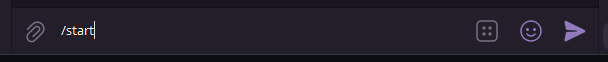
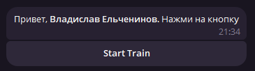
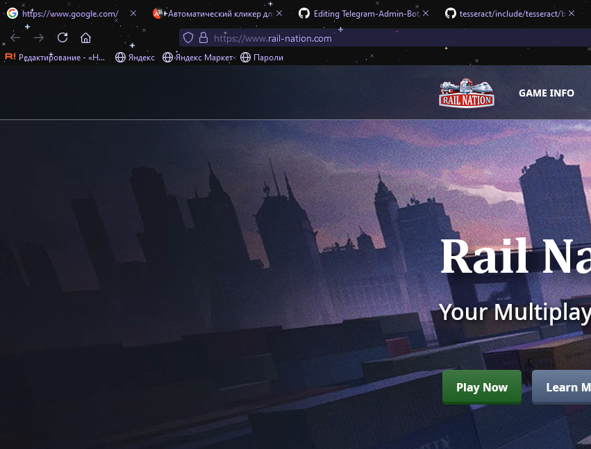
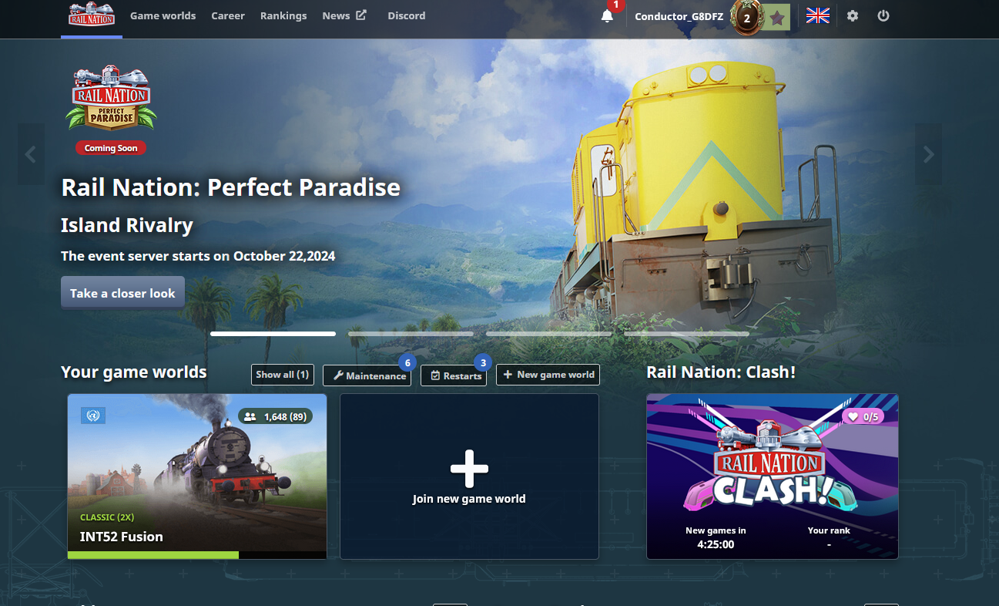
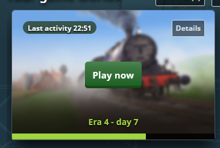
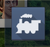
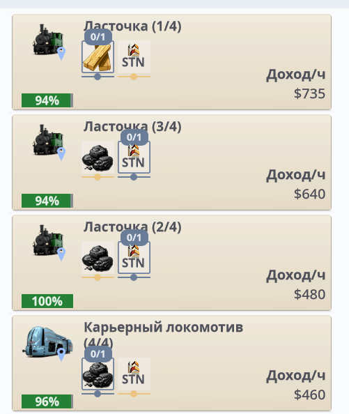
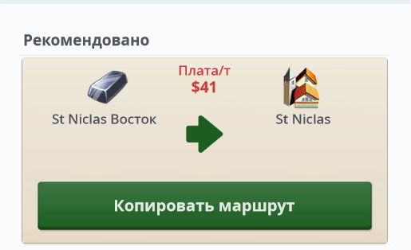
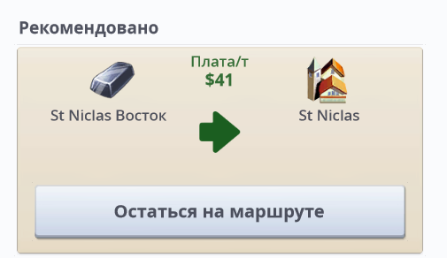

# 👆 Automatic clicker for rail-nation.com

Это бот, который по **нажатию кнопки** запускает основное действие игры. Он ставит поезд на **самый выгодный маршрут** и делает так, чтобы он вернулся обратно, а также **чинит поезд.**

## 📌 Функциональность
### 1️⃣Первый этап

-  Запустите бота в **Telegram** с помощью команды `/start`  

-  Дальше нажмите на кнопку `Start Train` - она переведет вас на сайт и **запустит действия кликера**  


### 2️⃣Второй этап

- Вы должны оказаться на **основном сайте** 
- После регистрации вы попадете на **основной экран** выбора игры 
- Кликер сам нажимает на самую **первую игру** `это можно поменять`  

### 3️⃣Третий этап

- Вы попадаете на **основной экран** игры 
- Нажатие на **первую** кнопку нижнего меню (Можно добавить и на другие)  

- Выбор **сортировки** по `Доход (По убыванию)`   

- Выбор поезда **(автоматически самый первый)**  



### 4️⃣Четвертый этап

- **Починка** поезда  


- Выбор **рекомендуемого** маршрута  


- Делаем так, чтобы был **обратный рейс**  



## 🗂️ Библеотки
❗``Если у вас PyCharm, благодаря файлу requirements.txt все библиотеки установятся автоматически.``

Asyncio
```bash
$pip install asyncio
```

Python-dotenv
```bash
$pip install python-dotenv
```

Aiogram
```bash
$pip install aiogram
```

 PyAutoGUI
```bash
$pip install PyAutoGUI
```

## 📦 Структура проекта
- ##### `main.py:` Основной файл для запуска бота.
- ##### `.env:` TOKEN для запуска бота, он не должен показываться на GitHub.
- ##### `config.py:` Информация о пользователе (пароль и логин), он не должен показываться на GitHub из-за файла `.gitignore`.
- ##### `SiteWork/login.py:` Открытие сайта и авторизация на сайте.
- ##### `SiteWork/routeNew.py:` Основные действия всего кликера.


[](https://t.me/vvlad_islovv) 
[](https://discordapp.com/users/1144549294813224960/)
[](https://vk.com/vvlad_islovv)